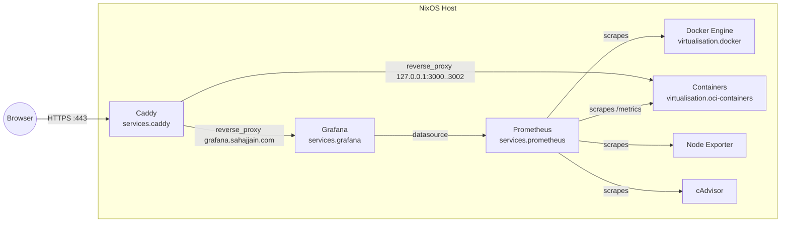

<div align="center">

# NixOS Homelab: Docker + Caddy + Prometheus + Grafana

<a href="https://nixos.org/">
  
</a>
<a href="https://nixos.wiki/wiki/Flakes">
  
</a>
<a href="https://www.docker.com/">
  
</a>
<a href="https://caddyserver.com/">
  
</a>
<a href="https://prometheus.io/">
  
</a>
<a href="https://grafana.com/">
  
</a>
<a href="https://www.arm.com/">
  
</a>
<a href="https://img.shields.io/website?url=https%3A%2F%2Fgrafana.sahajjain.com">
  
</a>

<br/>

<a href="https://github.com/SahajJain01/nixos-config/stargazers">
  
</a>
<a href="https://github.com/SahajJain01/nixos-config/commits">
  
</a>

</div>

---

Production-ready, secure-by-default NixOS configuration for running Dockerized apps behind Caddy with automatic HTTPS and first-class observability (Prometheus + Grafana). Containers bind to loopback; Caddy is the only public entrypoint.

## Highlights
- Declarative containers via `virtualisation.oci-containers` in `containers.nix`.
- Secure edge: Caddy TLS + ACME + HSTS on ports 80/443 only.
- Observability: Prometheus server, Node Exporter, Docker engine metrics, cAdvisor, and Grafana pre-provisioned.
- Reproducible infra: pinned Nix flake with aarch64 target.
- Simple ops: `nswitch` alias for `nixos-rebuild switch`.

## Domains
- calendar.sahajjain.com → `127.0.0.1:3000`
- pizza.sahajjain.com → `127.0.0.1:3001`
- lingscript.sahajjain.com → `127.0.0.1:3002`
- grafana.sahajjain.com → `127.0.0.1:3030`

## Architecture



## Repo Layout
- `flake.nix` – Flake outputs for the NixOS system (`aarch64-linux`).
- `configuration.nix` – Core OS/services (Docker, SSH, users, Nix).
- `hardware-configuration.nix` – Auto-generated hardware profile.
- `firewall.nix` – Only TCP 80/443 open.
- `containers.nix` – Docker containers and cAdvisor.
- `caddy.nix` – Public vhosts; HTTPS and reverse proxying.
- `monitoring.nix` – Prometheus, exporters, Grafana provisioning.

## Getting Started
1) Point DNS A/AAAA records to this server for all domains above.
2) Apply the configuration: `sudo nixos-rebuild switch` (or `nswitch`).
3) Visit your apps and Grafana:
   - https://calendar.sahajjain.com, https://pizza.sahajjain.com, https://lingscript.sahajjain.com
   - https://grafana.sahajjain.com (default admin/admin unless configured otherwise)

## Monitoring & Observability
- Prometheus: `127.0.0.1:9090` (scrapes the targets below)
- Node Exporter: `127.0.0.1:9100` (host metrics)
- Docker Engine Metrics: `127.0.0.1:9323`
- cAdvisor: `127.0.0.1:8080` (per-container metrics)
- Bun app metrics: `/metrics` on app ports (3000/3001/3002)
- Grafana: https://grafana.sahajjain.com (datasource pre-provisioned)

Quick checks
```bash
curl -fsS http://127.0.0.1:9090/-/ready && echo OK
curl -fsS http://127.0.0.1:9100/metrics | head -n1
curl -fsS http://127.0.0.1:9323/metrics | head -n1
curl -fsS http://127.0.0.1:8080/metrics | head -n1
```

### Instrumenting Bun Apps for /metrics
Each Bun app should expose `GET /metrics` using `prom-client`. They already listen on the needed ports, so Prometheus scrapes them automatically.

Minimal example (TypeScript):
```ts
import client from 'prom-client'

// Singleton registry
const register = new client.Registry()
client.collectDefaultMetrics({ register })

// Custom HTTP metrics
const httpRequests = new client.Counter({
  name: 'http_requests_total',
  help: 'Total HTTP requests',
  labelNames: ['method', 'path', 'status'] as const,
})
const httpLatency = new client.Histogram({
  name: 'http_request_duration_seconds',
  help: 'Request duration in seconds',
  labelNames: ['method', 'path', 'status'] as const,
  buckets: [0.01, 0.05, 0.1, 0.3, 0.5, 1, 2, 5],
})
register.registerMetric(httpRequests)
register.registerMetric(httpLatency)

const METRICS_ENABLED = process.env.METRICS_ENABLED !== 'false'

Bun.serve({
  port: 3000,
  async fetch(req) {
    const url = new URL(req.url)
    if (METRICS_ENABLED && url.pathname === '/metrics') {
      return new Response(await register.metrics(), {
        headers: {
          'Content-Type': register.contentType,
          'Cache-Control': 'no-store',
        },
      })
    }

    const path = url.pathname
    const method = req.method
    const start = performance.now()
    const res = new Response('ok')
    const status = res.status.toString()
    if (METRICS_ENABLED && path !== '/metrics') {
      httpRequests.labels(method, path, status).inc()
      httpLatency.labels(method, path, status).observe((performance.now() - start) / 1000)
    }
    return res
  },
})
```

Tip: Install the dependency in each app: `bun add prom-client`.

## CI: nixos-rebuild over SSH (example)

```yaml
name: Deploy
on:
  push:
    branches: [ main ]
jobs:
  deploy:
    runs-on: ubuntu-latest
    steps:
      - uses: actions/checkout@v4
      - uses: cachix/install-nix-action@v27
        with:
          extra_nix_config: accept-flake-config = true
      - name: Rebuild and switch remotely
        env:
          NIX_SSH_HOST: ${{ secrets.NIX_SSH_HOST }}
          NIX_SSH_USER: ${{ secrets.NIX_SSH_USER }}
          NIX_SSH_KEY:  ${{ secrets.NIX_SSH_KEY }}
        run: |
          set -euo pipefail
          mkdir -p "$HOME/.ssh"
          install -m 600 /dev/null "$HOME/.ssh/id_ed25519"
          printf '%s\n' "$NIX_SSH_KEY" > "$HOME/.ssh/id_ed25519"
          ssh-keyscan -H "$NIX_SSH_HOST" >> "$HOME/.ssh/known_hosts"
          export NIX_SSHOPTS='-i $HOME/.ssh/id_ed25519 -o StrictHostKeyChecking=accept-new'
          nix run nixpkgs#nixos-rebuild -- \
            switch --flake github:<owner>/<repo>#nixos \
            --target-host "$NIX_SSH_USER@$NIX_SSH_HOST" \
            --use-remote-sudo
```

## Security
- Services bind to loopback; Caddy is the only public entrypoint.
- TLS termination with ACME and HSTS enabled.
- Prometheus, exporters, and Grafana listen on localhost; Grafana is exposed via Caddy only.

## Troubleshooting
- `oci-containers` does not support `restartPolicy` (use container defaults).
- Ensure image names have no stray semicolons (e.g., `:latest;` → `:latest`).
- Full trace: `nixos-rebuild switch --show-trace`.
- Logs:
  - `journalctl -u caddy -e --no-pager`
  - `journalctl -u prometheus -e --no-pager`
  - `journalctl -u grafana -e --no-pager`
  - `journalctl -u prometheus-node-exporter -e --no-pager`
  - `journalctl -u oci-containers-cadvisor -e --no-pager`

## Roadmap / Ideas
- Provision curated Grafana dashboards for host, Docker, and apps.
- Set Grafana admin password via Nix secret (`services.grafana.settings.security`).
- Add alerting rules and email/Slack notifications.

