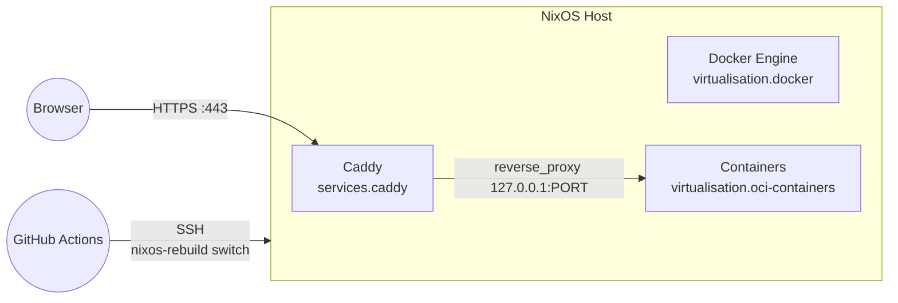

<div align="center">

# NixOS Docker + Caddy (HTTPS) — Flake‑Powered Infra

<a href="https://nixos.org/">
  
</a>
<a href="https://nixos.wiki/wiki/Flakes">
  
</a>
<a href="https://www.docker.com/">
  
</a>
<a href="https://caddyserver.com/">
  
</a>
<a href="https://letsencrypt.org/">
  
</a>
<a href="https://www.arm.com/">
  
</a>
<a href="https://github.com/features/actions">
  
</a>

<br/>

<a href="https://github.com/SahajJain01/nixos-config/stargazers">
  
</a>
<a href="https://github.com/SahajJain01/nixos-config/commits">
  
</a>

</div>

---

Production‑ready NixOS template for running Dockerized apps behind Caddy with automatic HTTPS, strict TLS, and a simple flake‑based workflow. Containers bind only to loopback; Caddy is the single public entrypoint.

## Highlights
- Declarative containers: `virtualisation.oci-containers` in `containers.nix`.
- Secure edge: Caddy TLS with ACME, HSTS, HTTP→HTTPS.
- Minimal surface: loopback bindings; only 80/443 exposed.
- Reproducible infra: flake‑pinned NixOS configuration.
- CI‑friendly: rebuild remotely via `nixos-rebuild switch` over SSH.

## Architecture



## Repo Layout
- `containers.nix` — Docker containers, loopback port bindings.
- `caddy.nix` — Caddy vhosts reverse proxying to `127.0.0.1:<port>`; ACME email configured.
- `configuration.nix` — Host services (Docker, SSH, base OS).
- `firewall.nix` — Opens only TCP `80` and `443`.
- `flake.nix` — Flake outputs for NixOS system.

## Prerequisites
- DNS A/AAAA record for your domain points to this server.
- NixOS with flakes enabled (already enabled here).

## Usage
- Apply config: `sudo nixos-rebuild switch` (alias: `nswitch`).
- Verify services:
  - `systemctl status caddy`
  - `systemctl status docker-<name>` (replace `<name>` with your container)
- Smoke tests:
  - `curl -fsS http://127.0.0.1:<port> | head -n1`
  - `curl -I https://<your-domain>`

## Customize
- Add/modify containers in `containers.nix` under `virtualisation.oci-containers.containers`.
  - Prefer immutable images via digest pinning: `image = "registry/repo@sha256:<digest>";`
  - Keep `extraOptions = [ "--pull=always" ];` if desired.
  - Bind ports to loopback: `ports = [ "127.0.0.1:<port>:<port>" ];`.
- Add/modify vhosts in `caddy.nix` using `services.caddy.virtualHosts."<domain>".extraConfig` and `reverse_proxy 127.0.0.1:<port>`.
- Set a valid ACME email in `services.caddy.email`.

## CI: nixos‑rebuild over SSH (no deploy‑rs)

```yaml
name: Deploy
on:
  push:
    branches: [ main ]
jobs:
  deploy:
    runs-on: ubuntu-latest
    steps:
      - uses: actions/checkout@v4
      - uses: cachix/install-nix-action@v27
        with:
          extra_nix_config: accept-flake-config = true
      - name: Rebuild and switch remotely
        env:
          NIX_SSH_HOST: ${{ secrets.NIX_SSH_HOST }}
          NIX_SSH_USER: ${{ secrets.NIX_SSH_USER }}
          NIX_SSH_KEY:  ${{ secrets.NIX_SSH_KEY }}
        run: |
          set -euo pipefail
          mkdir -p "$HOME/.ssh"
          install -m 600 /dev/null "$HOME/.ssh/id_ed25519"
          printf '%s\n' "$NIX_SSH_KEY" > "$HOME/.ssh/id_ed25519"
          ssh-keyscan -H "$NIX_SSH_HOST" >> "$HOME/.ssh/known_hosts"
          export NIX_SSHOPTS='-i $HOME/.ssh/id_ed25519 -o StrictHostKeyChecking=accept-new'
          nix run nixpkgs#nixos-rebuild -- \
            switch --flake github:<owner>/<repo>#nixos \
            --target-host "$NIX_SSH_USER@$NIX_SSH_HOST" \
            --use-remote-sudo
```

## Security
- Services listen only on loopback; Caddy is the only public entrypoint.
- Only ports 80/443 are open; TLS is terminated at Caddy with HSTS enabled.

## Troubleshooting
- If you see “The option `virtualisation.oci-containers.containers.services.caddy` does not exist”, ensure Caddy lives in `caddy.nix` under `services.caddy`, not inside `containers.nix`.
- Show a detailed trace: `nixos-rebuild switch --show-trace`.
- Inspect logs:
  - `journalctl -u caddy -e --no-pager`
  - `journalctl -u docker-<name> -e --no-pager`
